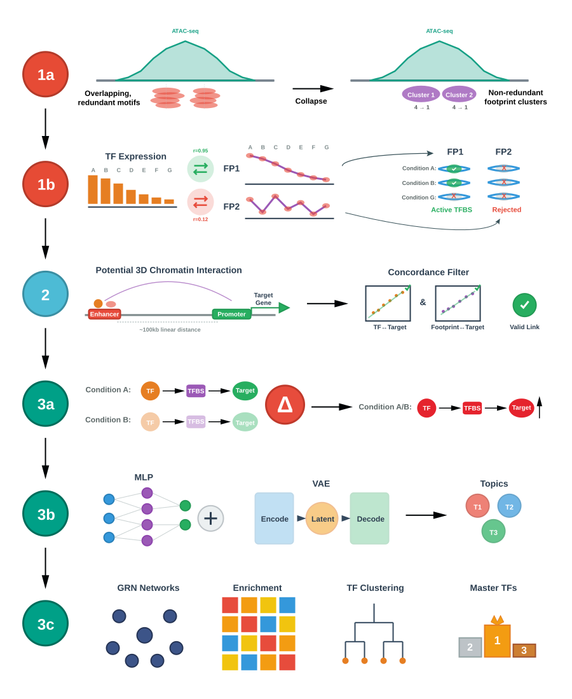
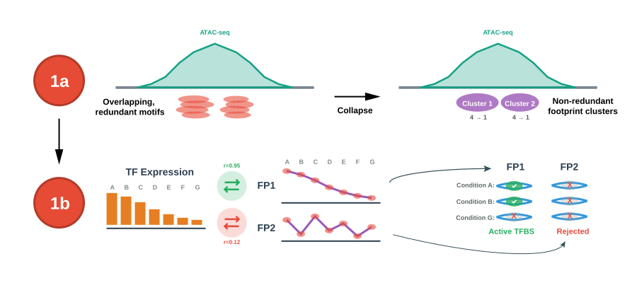
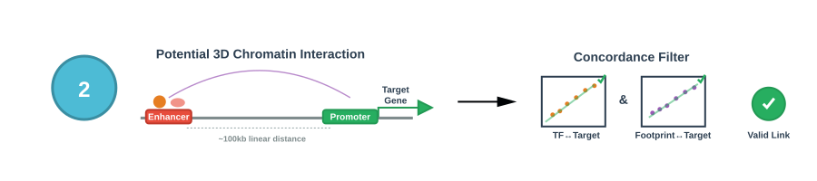
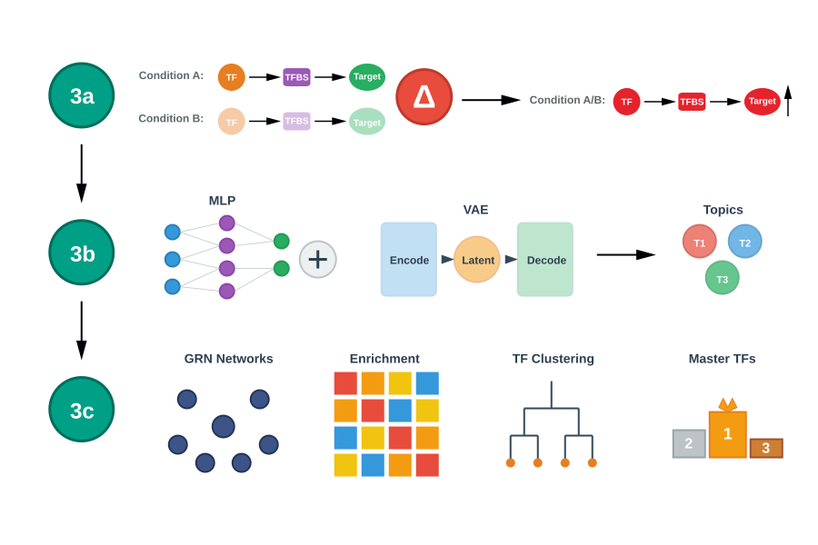

CraftGRN
========

[](https://github.com/oncologylab/craftgrn)
[](https://github.com/oncologylab/craftgrn/blob/main/LICENSE.md)
[](https://oncologylab.github.io/craftgrn/)
[](https://github.com/oncologylab/craftgrn/graphs/commit-activity)
[]()

## Introduction

**CraftGRN** is a modular framework for integrating chromatin accessibility
profiles from ATAC-seq with matched RNA-seq expression data to infer
condition-specific transcription factor binding sites and reconstruct dynamic
gene regulatory networks.

CraftGRN helps users:

- Collapse overlapping TF motif footprints into consensus, site- and
  motif-nonredundant footprint clusters.
- Infer condition-specific canonical and non-canonical TF binding sites by
  correlating TF expression with footprint or chromatin accessibility scores.
- Refine TF->TFBS->gene regulatory priors using enhancer-gene maps, genomic
  proximity, or user-supplied chromatin interaction data.
- Extract active regulatory links within each condition and compare links
  between conditions.
- Learn regulatory topics from RNA and footprint signals using topic modeling
  and VAE-based representations.
- Generate summaries and visualizations for topic- and condition-specific
  regulatory programs.



## Installation

CraftGRN can be installed from GitHub:

```r
# Using remotes
remotes::install_github("oncologylab/craftgrn")

# or using pak
pak::pak("oncologylab/craftgrn")
```

Common CRAN and Bioconductor dependencies can be installed with:

```r
install.packages(c("igraph", "ggplot2", "data.table", "BiocManager"))
BiocManager::install(c("DESeq2", "GenomicRanges", "SummarizedExperiment"))
```

## Pipeline Overview

CraftGRN is organized as a three-module workflow.

### Module 1: Predict TF Binding Sites

Module 1 loads matched ATAC, RNA, metadata, and optional footprint score files,
then prepares a multiomic data object for downstream regulatory analysis.

Primary package functions:

- `load_prep_multiomic_data()` loads, filters, aligns, and prepares multiomic
  inputs from a YAML configuration file.
- `correlate_tf_to_fp()` correlates TF expression with footprint or peak signal
  across matched conditions to nominate condition-specific TF binding sites.



### Module 2: Connect TFs to Target Genes

Module 2 links TF binding sites to candidate target genes using enhancer-gene
maps, genomic distance windows, or 3D chromatin interaction priors. Candidate
TF->TFBS->target links are filtered by condition-specific expression, binding,
footprint or peak signal, and cross-condition correlation evidence.



### Module 3: Learn Regulatory Topics and Visualize Differential GRNs

Module 3 compares condition-specific regulatory links, builds joint RNA and
footprint document-term matrices, trains topic models, assigns regulatory links
to topics, and summarizes pathway and master TF programs.

Primary package functions:

- `train_topic_models()` trains regulatory topic models across a user-defined
  topic-number grid.
- `extract_regulatory_topics()` assigns links and terms to selected regulatory
  topics.
- `run_diff_grn_pathway_analysis()` and related plotting functions summarize
  pathway programs.
- `run_diff_grn_master_tf_summary()` and related plotting functions summarize
  master TF connectivity.



## Get Started

For a module-by-module tutorial, see the
[Get started article](https://oncologylab.github.io/craftgrn/articles/craftgrn.html).

## Documentation

- Website: https://oncologylab.github.io/craftgrn/
- Reference: https://oncologylab.github.io/craftgrn/reference/
- Issues: https://github.com/oncologylab/craftgrn/issues

## Citation

Li, Y., Yi, C. et al. (in preparation).
**CraftGRN:** Integrative ATAC-RNA framework for condition-specific gene
regulatory network analysis.

## License

This project is licensed under the GNU General Public License v3.0.
